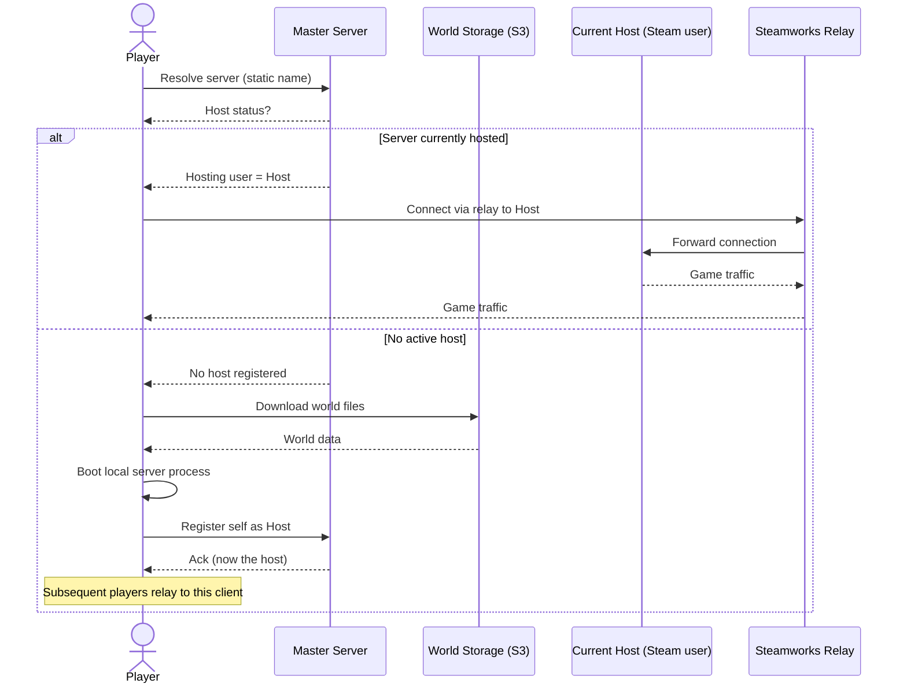

# Serverless Servers (P2P Relay Hosting)

## Idea

Run 24/7-feeling Minecraft servers without paying for always-on backend
infrastructure. World files live in cold storage (e.g. S3) under a static,
stable identity (a "server name" the player always connects to, regardless of
who is actually running it right now).

A custom server type in the mod resolves that static identity through a
master server, which tracks which Steam user (if any) is currently hosting.

- **If someone is hosting**: the connecting player is relayed to that host's
  machine over the Steamworks P2P/relay network. No dedicated backend ever
  runs the actual game logic.
- **If nobody is hosting**: the connecting player's client downloads the
  world files from storage, boots a local server process, and registers
  itself with the master server as the new host. Later players get relayed
  to them instead.

Effectively: a self-electing, migrating host, with Steam's relay network
standing in for a traditional server's networking layer, and S3 as durable
state for when the "cluster" is fully idle.

## Open questions

- **Static identity vs. static IP**: a literal static IP isn't achievable
  P2P, since the host is a different machine each time. The client-facing
  "address" needs to be a logical name (e.g. a Steam Lobby ID or a name
  resolved by our own master server), which the mod resolves to whoever
  currently holds it before relaying. Steam's own matchmaking/lobby system
  (`ISteamMatchmaking`) may be usable as the master server for free — lobbies
  already support host-ownership semantics and reassignment when a host
  leaves.
- **World consistency on host handoff**: mid-session saves, host crashes, and
  re-upload/re-download cadence to storage are probably the harder unsolved
  problem here, more than the networking itself.
- **Cold start cost**: first connect after a fully idle period pays a
  download + boot penalty (proportional to world size) before anyone can
  join.

## Sequence diagram

## Storage cost estimate (S3)

Pricing below is S3 Standard, `us-east-1`, verified May 2026:

| Item | Price |
|---|---|
| Storage | $0.023 / GB / month (first 50 TB) |
| PUT / COPY / POST / LIST | $0.005 / 1,000 requests |
| GET / SELECT | $0.0004 / 1,000 requests |
| Data transfer out (egress) | first 100 GB/month free, then $0.09/GB (up to 10 TB) |
| Data transfer in (upload) | free |

Two cost drivers apply here, and they behave very differently:

- **Storage** — charged every month regardless of activity, scales with how
  many worlds sit in the bucket.
- **Egress** — charged only when a world is *downloaded* (i.e. on a cold
  start, when a new host has to pull the files down before booting the
  server). This is the dominant cost, not storage, because $0.09/GB for a
  single download vastly outweighs $0.023/GB for a whole month of storage.
  Uploads (checkpoint saves, handoff at shutdown) are free — S3 doesn't
  charge for data transferred in.

### World size assumption

Minecraft's region files (`.mca`) are already zlib-compressed per chunk by
the game itself, so a generic archive (zip/tar.gz) on top only squeezes out
the small NBT/metadata files (`level.dat`, playerdata, stats, advancements)
and saves roughly **10–15%** on top of the raw folder size — not the 50%+
you'd expect from compressing uncompressed data.

| World profile | Raw size | Compressed (~85%) |
|---|---|---|
| Small (fresh/short-lived, <1 week) | 100 MB | ~85 MB |
| Medium (long-running SMP, few players, months) | 2 GB | ~1.7 GB |
| Large (year+, many players, elytra exploration/farms) | 15 GB | ~12.75 GB |

### Per-server monthly cost

Using the medium profile (~1.7 GB) as the representative case:

| Cost component | Formula | Amount |
|---|---|---|
| Storage | 1.7 GB × $0.023 | **$0.039/month** |
| One cold-start download | 1.7 GB × $0.09 | **$0.153/event** |
| Requests (1 PUT + 1 GET per handoff) | negligible | <$0.00001 |

So storage itself is effectively free per server. The real cost scales with
**churn** — how often a server goes idle and a new player has to re-download
it — not with how long a world sits in the bucket.

### Platform-scale example

1,000 medium (~1.7 GB) worlds, each cold-starting an average of 4×/month:

| Component | Calculation | Monthly cost |
|---|---|---|
| Storage | 1,000 × 1.7 GB × $0.023 | ~$39 |
| Egress | 1,000 × 4 × 1.7 GB × $0.09 (minus first 100 GB free) | ~$603 |
| Requests | 1,000 × 4 × (1 PUT + 1 GET) | ~$0.02 |
| **Total** | | **~$642/month (~$0.64/server)** |

Takeaways:
- Storage cost is negligible at any realistic scale; there's little reason
  to bother with cheaper storage classes (Standard-IA/Glacier) since their
  per-GB retrieval fees would eat into the already-small storage savings.
- Egress is the lever that matters. It's directly proportional to how often
  a session goes fully idle and gets picked back up — a "keep last host
  warm for N minutes before releasing" grace period would materially cut
  cost by avoiding needless re-downloads for briefly-empty servers.
- Large, heavily-explored worlds (12+ GB compressed) get expensive to
  cold-start ($1+ per event) — for those, incremental/delta sync (only
  re-download changed regions) would be worth building rather than
  re-pulling the whole world each time.

Sources: [AWS S3 Pricing](https://aws.amazon.com/s3/pricing/), [AWS S3 Pricing in 2026: What You'll Actually Pay](https://filebase.com/blog/aws-s3-pricing-in-2026-what-youll-actually-pay/)
