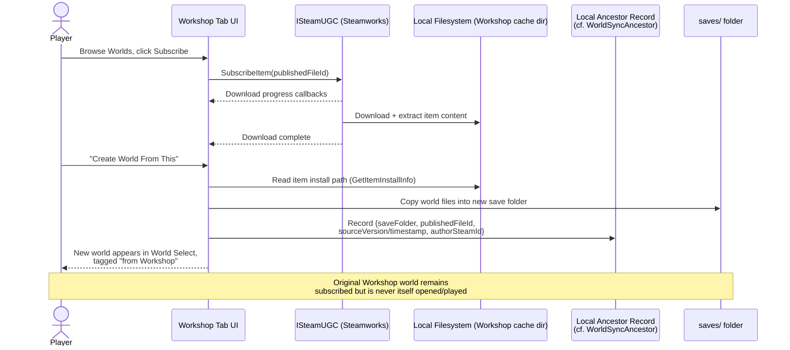
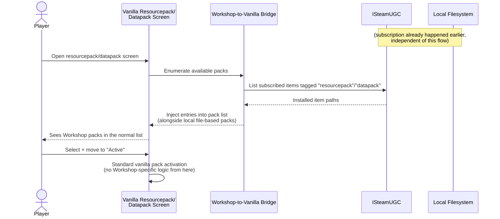
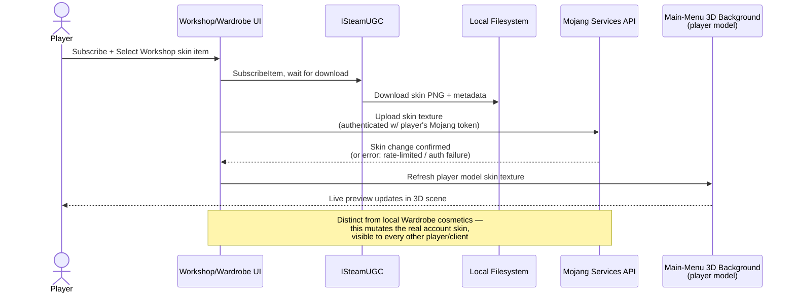

# Steam Workshop Support

## Idea

Let players browse, subscribe to, and use Steam Workshop content from inside
the game, covering at least five content types with meaningfully different
"what does subscribing actually do" semantics:

- **Worlds** — not directly playable. Subscribing downloads the archive;
  playing it requires an explicit "Create World from Workshop Item" action
  that clones it into a normal local save, which then carries a permanent
  back-reference to the Workshop item it came from (id, version/timestamp,
  author) for update-checking and "originally downloaded from" UI. This
  mirrors the ancestor-tracking pattern `steam-cloud-sync` already uses for
  cross-device world sync (`WorldSyncAncestor`,
  `features/steam-cloud-sync/src/main/java/de/lazuli/features/steamcloudsync/api/WorldSyncAncestor.java`)
  — a small local record binding a save folder to an external identity is
  already a proven shape in this codebase, just pointed at a Workshop item
  id instead of a device/fingerprint pair.
- **Datapacks / resourcepacks** — subscribing should make the item available
  as a selectable entry inside vanilla's own datapack/resourcepack UI, not a
  separate Workshop-only installer screen.
- **Skins** — subscribing/selecting triggers a real Mojang account skin
  change via the Mojang API (not a local resource-pack override), with live
  preview on the player model already rendered in the main menu's 3D
  background.
- **Speculative additional types** (none of these are requirements — flagged
  here only because the user asked for imagination-stretching, and Workshop
  items are just "a tagged file blob + metadata" so almost anything the mod
  already persists as a file is a plausible candidate):
  - Mod config/settings presets (e.g. a shareable `TweaksConfig` bundle from
    `features/tweaks`).
  - Structure/schematic files, if the mod ever supports import — none seen
    in this repo currently, this is pure speculation.
  - Server configs / bookmarked-server bundles (`BookmarkedServer` already
    exists as a synced concept in `steam-cloud-sync` — a "shareable server
    pack" is a small conceptual step from there).
  - Main-menu background/theme presets. **Checked**: the 3D background is
    currently a single shared baked mesh/animation
    (`docs/specs/unified-mainmenu-background.md`), explicitly **not**
    designed for swappable scenery — "not adding new visual features" and
    "not changing cube geometry values" are stated non-goals of that spec.
    So this is presented here as speculative and would require its own
    prerequisite work, not something Workshop support could plug into today.
  - Keybind/control presets — plausible, low effort, no evidence either way
    in the codebase.
  - Wardrobe cosmetic sets — the main menu already has a `WARDROBE` tab and
    an equip-map (`WardrobeConfig`,
    `features/main-menu/src/main/java/de/lazuli/features/mainmenu/config/WardrobeConfig.java`)
    for slot-based cosmetic items backed by a `StoreCatalog`. A Workshop
    cosmetic pack that adds entries to that catalog is a very natural
    extension — arguably more natural than the skin-API case, since it
    doesn't touch account state, just local catalog entries.

## Steamworks API shape (plausible, not verified against steamworks4j's actual bindings)

`steam-cloud-sync` establishes the pattern this would follow: exactly one
(or two) classes import `com.codedisaster.steamworks.*` directly, everything
else in the feature depends on a plain-JVM-testable interface
(`CloudFileStore`, `WorldArchiveCloudStore`) that a Noop implementation
satisfies when Steam isn't available
(`features/steam-cloud-sync/src/main/java/de/lazuli/features/steamcloudsync/services/SteamRemoteStorageCloudFileStore.java`,
`NoopCloudFileStore.java`). A `steam-workshop` feature would plausibly mirror
this shape exactly:

- `WorkshopContentStore` (interface) / `SteamUGCWorkshopContentStore` (real,
  isolated `com.codedisaster.steamworks.SteamUGC` import) /
  `NoopWorkshopContentStore` (fallback).
- `SteamUGC` calls needed, mapped to Steamworks' `ISteamUGC` (via
  steamworks4j's wrapper, unverified whether steamworks4j's UGC bindings
  cover the full surface — this would need the same `javap`-against-the-
  actual-jar verification pass the background-renderer spec did for render
  APIs before anyone commits to a plan):
  - Query/browse (`CreateQueryAllUGCRequest` equivalent) with tag filtering
    per content type (world / datapack / resourcepack / skin / other).
  - Subscribe / unsubscribe (`SubscribeItem`/`UnsubscribeItem`).
  - Download state + progress (`GetItemDownloadInfo`, download-complete
    callback) — needed for a subscription-manager UI showing per-item
    progress and disk usage.
  - Local install path lookup (`GetItemInstallInfo`) — this is the bridge
    into "copy into `saves/`" (worlds), "register in datapack search path"
    (datapacks/resourcepacks), or "read skin PNG + upload via Mojang API"
    (skins).
  - Upload (`StartItemUpdate`/`SubmitItemUpdate`) — only relevant if
    publish-to-Workshop is in scope (see open questions; not assumed here).
    **Verified**: `ISteamUGC` publishes content as a Steam depot, not
    through the deprecated `ISteamRemoteStorage` publish path — depots have
    no fixed per-item size ceiling and don't count against Steam Cloud
    storage quota. So a multi-GB world upload is technically fine; the
    practical ceiling is upload bandwidth/time, not an API limit. Source:
    [ISteamUGC](https://partner.steamgames.com/doc/api/ISteamUGC),
    [Workshop Implementation Guide](https://partner.steamgames.com/doc/features/workshop/implementation).
- Tagging convention: Workshop content type would need to be identified via
  UGC tags (Steamworks' own convention for "what kind of item is this" —
  e.g. `world`, `datapack`, `resourcepack`, `skin`), since ISteamUGC itself
  has no first-class "content type" field. **Verified**: `CreateQueryAllUGCRequest`
  combined with `AddRequiredTag` is the correct mechanism for this — results
  paginate at up to 50 items/page. Source:
  [ISteamUGC](https://partner.steamgames.com/doc/api/ISteamUGC).
- **Verified**: subscribe/download (`SubscribeItem`/`DownloadItem`, with
  `GetItemDownloadInfo` for progress callbacks) rides the same depot/patching
  system as regular game content — updates to an already-subscribed item
  **delta-patch** (only changed bytes re-download) rather than re-fetching
  the whole item. This meaningfully changes the cost/complexity picture for
  the "source Workshop world updates after a local instance already exists"
  open question below — re-sync of the *subscribed* copy is cheap and
  automatic; the open question is really about what to do with the
  already-instanced local *clone*, not about re-download cost. Source:
  [Item Versioning](https://partner.steamgames.com/doc/features/workshop/itemversioning).

### Version/compatibility tagging (Minecraft version, `pack_format`)

**This is a real gap, not a solved problem.** Valve's Workshop/`ISteamUGC`
has no built-in game-version concept at all — Steam does not know or care
what "Minecraft version" or "`pack_format`" means. The mod would need to
invent its own convention entirely on top of the generic tag/metadata
primitives:

- A required tag per compatible version (e.g. `mc:1.21`) and/or
  `SetItemMetadata`/`AddItemKeyValueTag` key-value fields (e.g.
  `mc_version`, `pack_format`) attached at upload time. Both are queryable
  via the browse/query filters **without downloading the item first**, so a
  browse UI could filter out or grey-out/warn on incompatible items before
  the player subscribes.
- Precedent from RimWorld and Cities: Skylines: both use self-defined
  required tags/metadata for version compatibility, and both still show a
  post-hoc "may not be compatible with your version" warning in the UI
  rather than hard-blocking subscription — version enforcement is a UX
  layer the game itself has to build; Steam won't gate it automatically.
- This affects all three version-sensitive content types here — worlds
  (tied to a Minecraft data version), datapacks (tied to `pack_format`),
  and resourcepacks (tied to `pack_format`) — and `pack_format` numbers
  change periodically even across small Minecraft version bumps, so this
  tagging convention is an ongoing maintenance surface, not a one-time
  decision made at feature-launch time.
- **Open**: should the required-version tag be a single MC version string, a
  version *range* (a world/pack often works across several patch versions),
  or should items instead advertise `pack_format` numbers directly (more
  precise for datapacks/resourcepacks, but less human-readable for worlds,
  which don't really have a single "pack_format" concept)? Not resolved
  here.

Sources:
[ISteamUGC](https://partner.steamgames.com/doc/api/ISteamUGC),
[Cities: Skylines mod troubleshooting](https://skylines.paradoxwikis.com/Mod_troubleshooting)
(real-world example of self-built version-warning UX on top of Workshop).

**Precedent reality check (verified)**: most Workshop usage across games
skews toward mods/maps/cosmetic assets rather than full save games. Cities:
Skylines does ship native whole-save Workshop sharing — real precedent for
the "worlds as Workshop items" model this doc proposes — but it's less
universal than the doc might otherwise imply; don't assume every design
pattern from a "Workshop asset browser" (built for small cosmetic/map
items) transfers cleanly to multi-GB world saves without checking. Source:
[Cities: Skylines Workshop save-sharing discussion](https://steamcommunity.com/app/255710/discussions/0/1694922980043829784/).

## UI/UX brainstorm

The user asked specifically for help imagining this, given the main menu's
tab system (`MainMenuTab` — `HOME, WORLDS, SERVERS, STORE, WARDROBE,
ACHIEVEMENTS, STATISTICS, TWEAKS, PAUSE`,
`api/src/main/java/de/lazuli/api/mainmenu/MainMenuTab.java`) and existing
screens (world select, resource packs, wardrobe) as the extension points.
Three directions, roughly ordered by how much new surface area they add:

### Direction A — new top-level `WORKSHOP` tab, sub-categorized

Add `WORKSHOP` to `MainMenuTab`, alongside `STORE`. Inside it, a
sub-navigation (tabs-within-a-tab, or a left rail) per content type: Worlds,
Datapacks, Resourcepacks, Skins, (Other). Each sub-category is its own
browse/search/subscribe grid, similar in spirit to how `STORE` presumably
already renders `StoreCatalog` entries
(`features/main-menu/src/main/java/de/lazuli/features/mainmenu/services/StoreCatalog.java`).

- **Pros**: one obvious home for "go find new stuff," matches how Steam's
  own Workshop pages work (players already have this mental model from
  other games), easiest to keep a consistent subscribe/download-progress/
  disk-usage panel in one place, doesn't require touching vanilla screens
  for the *browsing* half.
- **Cons**: doesn't solve the "I'm already in World Select and want to
  install this specific pack right now" moment — the datapack/resourcepack
  and skin use cases specifically asked for hooking into *existing* vanilla
  flows, and a standalone tab is one hop removed from that. Also directly
  extends the always-visible tab bar for a feature that a Steam-less/non-
  Steam player can't use at all (see open questions), which is a permanent
  UI cost for a conditional feature.

### Direction B — inline entry points embedded in existing screens

No new tab. Instead:

- World Select screen gets a "Browse Workshop Worlds" button/section
  alongside "Create New World."
- Vanilla's datapack-selection screen (in world creation and in the
  in-world datapack menu) and resourcepack screen each get a "Workshop"
  filter/section injected alongside the local-file list — i.e. Workshop
  items appear *as entries in the existing list*, not a separate screen.
  This is closest to what the user explicitly asked for ("reusing/hooking
  into vanilla's existing selection UI").
- Skins: hook into `WARDROBE` tab (it already exists and already has a
  slot/equip-map concept) as the "apply a skin" entry point, but the skin
  slot specifically triggers the Mojang API call path rather than a local
  cosmetic-catalog equip — visually similar interaction, different backend.

- **Pros**: matches the user's stated preference for reusing vanilla flows
  most literally; zero new persistent tab-bar real estate; content shows up
  exactly where a player would already be looking for it (about to pick a
  resourcepack? Workshop packs are right there in the same list).
- **Cons**: no single "discover new Workshop content" browsing experience —
  a player who just wants to explore what's available has no obvious place
  to go except stumbling into it contextually. Injecting into vanilla
  screens (especially the datapack/resourcepack pickers, which aren't part
  of this mod's custom UI framework at all) is likely the highest-effort,
  highest-fragility part of the whole feature — those are Mojang's own
  screens, subject to change every version, versus this mod's own
  `MainMenuTab`/`MainMenuContext` framework which the team controls.

### Direction C — hybrid: `WORKSHOP` tab for discovery, inline hooks for action

Keep a `WORKSHOP` tab (Direction A) as the single place to *discover and
subscribe* to anything, across all content types, with search/filter/sort
and a subscription/disk-usage manager. But the *consumption* moment — actually
using a subscribed item — happens inline (Direction B): a subscribed
world shows a "Create World From This" action right there in the Workshop
tab (not exposed for direct play — enforcing the instancing requirement),
and once a datapack/resourcepack/skin is subscribed, it simply *appears* as
a normal option in the relevant vanilla screen without the player needing
to go back to the Workshop tab.

- **Pros**: gets both things the user cares about — a real discovery/
  browsing home, and reuse of vanilla mechanics for actual application —
  without either screen needing to do both jobs. Splits the two hardest
  problems (Steamworks UGC integration and vanilla-screen injection) into
  separately shippable halves — the Workshop tab alone (browse + subscribe
  + local instancing for worlds) is already a complete, demoable feature
  before any vanilla-screen hooking exists.
- **Cons**: most total surface area of the three (still need both the new
  tab *and* the vanilla-screen injection work) — costs the sum of A's and
  B's effort rather than picking one. Two mental models for "where does
  Workshop content live" (a dedicated tab vs. woven into existing screens)
  could feel inconsistent if not carefully cross-linked (e.g. the vanilla
  resourcepack screen's Workshop-sourced entries should probably link back
  to "manage in Workshop tab").

**No recommendation is made here** — this is deliberately left as a genuine
open decision; C is the most complete answer but also the most work, and
whether that trade is worth it likely depends on how much of the vanilla-
screen injection work (the hardest, most fragile part) the team wants to
commit to versus deferring it to a later iteration on top of an A-shaped MVP.

## Content flow diagrams

### 1. Subscribing to and instancing a Workshop world

### 2. Applying a Workshop datapack/resourcepack via vanilla UI

### 3. Subscribing to a Workshop skin, Mojang API + live preview

## Open questions

- **DOWNGRADED (was ⚠ high-risk) to "two viable paths, pick deliberately":
  token access is confirmed possible, but the mod with the most reason to
  take the easy path chose not to.** Originally flagged as potentially
  feature-invalidating because it seemed a mod would have no supported way
  to obtain a Minecraft access token. Two things are now confirmed:
  1. **In-process access is real.** Both Fabric and Forge expose the
     client's live, already-authenticated session to any mod via a
     documented, public API —
     `MinecraftClient.getInstance().getSession().getAccessToken()` (Forge:
     `Minecraft.getInstance().getSession()`, same shape) — confirmed
     against Fabric's Yarn mappings docs back to at least 1.16.4. No
     reflection into internals required. (Corroborating, if grim, evidence:
     a documented malware case — a mod that stole session tokens via this
     exact call for account takeover — and a purpose-built defensive tool,
     [Token-Protector](https://github.com/cev-api/Token-Protector), built
     specifically to stop third-party mods from reading this exact field.)
  2. **But `SparkUniverse/Essential-Mod`'s real source (confirmed
     source-available, not a stub — audited directly) shows Essential
     deliberately does NOT take this shortcut**, despite being exactly the
     kind of mod that would benefit most. Instead it implements a complete,
     independent Microsoft OAuth → XBL → XSTS → Minecraft auth chain in
     `subprojects/minecraft-auth/` (`MicrosoftAuthenticationService.kt`,
     `XboxLiveAuthenticationService.kt`, `MinecraftAuthenticationService.kt`),
     with its own OAuth browser flow, and calls
     `MojangAPI.changeSkin(accessToken, uuid, model, url)`
     (`gui/essential/src/main/kotlin/gg/essential/util/MojangAPI.kt:47`)
     with a token from *its own* account manager — never from the game's
     session object.

  **Reading between those two facts**: Essential's choice is evidence, not
  just caution — likely reasons are that the vanilla session token isn't
  safely refreshable from mod-side (Essential needs long-lived, renewable
  auth), it needs to support multiple/alternate accounts (not just
  whatever's currently logged into the client), and reusing a
  client-session token for out-of-band API calls beyond its intended
  purpose sits in legally/ToS-murky territory even though it's technically
  reachable. So the real choice for this feature isn't "is it possible"
  (yes) but **which of two paths to take**:
  - **Path A — reuse `Session.getAccessToken()`. (Preferred direction, per
    project owner.)** Least implementation effort, no separate login UI —
    the player is already logged into the client this mod runs inside, and
    that's the only account this feature needs to act on (unlike Essential,
    which needs multi-account support this mod doesn't). Tradeoffs to
    watch for once this moves to a spec: uncertain token refresh/lifetime
    behavior (the vanilla session token may not be designed to be reused
    for calls outside the client's own auth flow, so a long Workshop-browsing
    session might hold a token that's expired by the time a skin change is
    attempted — needs verification), and this is the least-tested-by-precedent
    path (Essential, the mod best positioned to take this shortcut, chose
    not to — worth understanding why in more depth before committing, even
    though the reasons guessed above look like they may not apply here).
  - **Path B — build an independent OAuth flow like Essential's**, own
    account/token management, more implementation effort and a browser-based
    login UX to build, but proven-viable (Essential ships this today) and
    avoids the refresh/reuse-legitimacy concerns of Path A. Kept here as the
    fallback if Path A's refresh/lifetime behavior turns out to be a real
    problem in practice.

  Neither path is a technical blocker; Path A is the preferred starting
  point given this mod's simpler single-account use case, with Path B as
  the documented fallback. Sources:
  [wiki.vg Mojang API](https://wiki.vg/Mojang_API),
  [Mojang API docs (skin change)](https://mojang-api-docs.gapple.pw/needs-auth/change-skin),
  [Fabric Yarn `Session` mappings](https://maven.fabricmc.net/docs/yarn-1.21.5+build.1/net/minecraft/client/session/Session.html),
  [Weedhack Stealer analysis](https://0xresetti.github.io/weedhack.html),
  [SparkUniverse/Essential-Mod](https://github.com/SparkUniverse/Essential-Mod)
  (`subprojects/minecraft-auth/`, `gui/essential/.../MojangAPI.kt`).
- **Moderation/reporting.** Steam Workshop has its own report/flag/ban
  mechanisms at the platform level, but does this mod need any in-mod
  moderation surface (e.g. hiding a reported item locally before Valve
  acts on it), or is deferring entirely to Steam's own Workshop moderation
  acceptable? Datapacks in particular can contain arbitrary
  functions/predicates — is any sandboxing or scanning expected, or is
  "you subscribed to it, you accepted the risk" the assumed posture (same
  as manually downloading a datapack today)?
- **Update/versioning semantics for already-instanced content.** (Note:
  re-download cost for the *subscribed* copy itself is a non-issue — Steam
  delta-patches updates automatically, see "Version/compatibility tagging"
  above. The open question is entirely about the already-*instanced local
  clone*, not about sync cost.) A subscribed world gets cloned into a local
  save at time T. The Workshop item then updates at T+1. What happens to
  the local save?
  - Never auto-updates (the clone is now fully independent) — simplest, but
    then "update available" UI is purely informational, never actionable
    without a manual re-instance-and-merge step (which raises its own
    "what about the player's changes since T" problem).
  - Offers a diff/merge — almost certainly out of scope for a first pass,
    full region-file merging is a hard problem on its own.
  - What about datapacks/resourcepacks already *installed into an existing
    world* — do they auto-update in place when the Workshop item updates
    (matching how Steam normally silently updates subscribed items), or
    does that risk changing behavior mid-playthrough without the player
    asking for it (e.g. a datapack update mid-world could break existing
    structures/loot tables)?
- **Disk space / subscription management.** Steam Workshop subscriptions
  accumulate on disk independent of whether the mod is even running. Does
  the mod need its own "manage subscriptions / free up space" UI, or is
  that left entirely to Steam's own Workshop management (which exists
  outside the game)? If in-mod, does unsubscribing from inside the mod also
  need to handle "this world was already instanced from it" (i.e. does
  losing the source Workshop item break the ancestor reference, or does the
  ancestor record just become "orphaned" but harmless)?
- **Upload/publish scope.** Everything above assumes browse + subscribe
  only. Is publishing player-created worlds/packs/skins *to* Workshop from
  inside the mod in scope at all, now or later? This changes the API
  surface significantly (`StartItemUpdate`/`SubmitItemUpdate`, legal/content
  agreement UI, preview image capture, etc.) and probably deserves its own
  separate idea document if it's wanted, rather than folding it into this
  one.
- **Skin API rate limits.** (Auth feasibility is now covered by the
  high-risk item at the top of this section.) Assuming the token-access
  problem is solved somehow, what's Mojang's current rate limit for skin
  changes (historically there has been per-account cooldown behavior), and
  what UX handles hitting it (e.g. subscribing to several skins in a row and
  only being able to apply one)? Not yet researched.
- **Offline / non-Steam fallback.** `steam-cloud-sync` already has a
  `NoopCloudFileStore` pattern for "Steam unavailable" — Workshop would
  presumably need the same `NoopWorkshopContentStore` fallback. But unlike
  cloud sync (which degrades gracefully to "just don't sync"), Workshop
  browsing has no non-Steam equivalent at all — is the entire feature (tab,
  vanilla-screen injections, everything) simply hidden/disabled when Steam
  isn't available, or does some reduced experience make sense (e.g. still
  showing "originally from Workshop" attribution on an already-instanced
  world even if the Steam connection needed to check for updates isn't
  there)?
- **Cross-content-type consistency of the "instancing" idea.** Worlds are
  explicitly required to be copy-on-use with a back-reference. Should
  datapacks/resourcepacks/skins conceptually follow the same
  "subscription is not the same as usage" split (subscribe now, apply
  later, keep a reference), or is a simpler "subscribed = active"
  model fine for those since they don't have the "can't play a Workshop
  world directly" ownership problem that worlds have? Right now the
  requirements read as three different models for four-plus content types,
  which is fine but worth naming explicitly before any spec is written.
